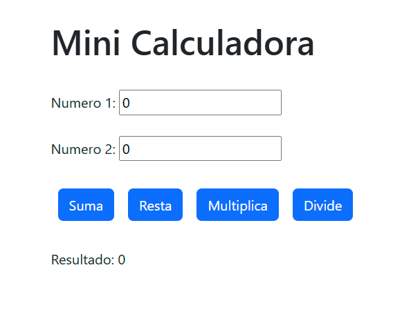

## Trabajo Mini Calculadora App

Este proyecto fue generado con [Angular CLI](https://github.com/angular/angular-cli) version 18.0.4. Como práctica para un curso que estoy realizando.

Comenzando con Angular, he creado esta mini calculadora muy básica en términos de funcionalidad y diseño, pero representa el inicio de mi camino de aprendizaje en esta potente tecnología. Con una base sólida en JavaScript, estoy emocionada por profundizar en Angular y desarrollar aplicaciones más completas y dinámicas, alineadas con las demandas del sector.

## Servidor de desarrollo

Ejecute `ngserve` para un servidor de desarrollo. Navegue hasta `http://localhost:4200/`. La aplicación se recargará automáticamente si cambia alguno de los archivos fuente.

## Tecnologías Utilizadas

- HTML5
- CSS3
- TypeScript
- Angular v18.0.4

## Capturas de Pantalla

## Contacto

Para cualquier consulta, oportunidad laboral o colaboración, no dudes en contactarme:

- Nombre: Alexandra Ferrera
- Perfil de Linkedin: [Mi LinkedIn](https://www.linkedin.com/in/alexandra-ferrera-arenas/)
- Correo Electrónico:  [Mi email](sandraferreraarenas@gmail.com)
- Porfolio: [Alexandra Ferrera Desarrolladora Frontend & UX/UI](https://alexandra-ferrera-portfolio.netlify.app/)

#portfolio #frontenddeveloper #webdevelopment #html #css #javascript #uxui #design #responsive #cleanCode #angular